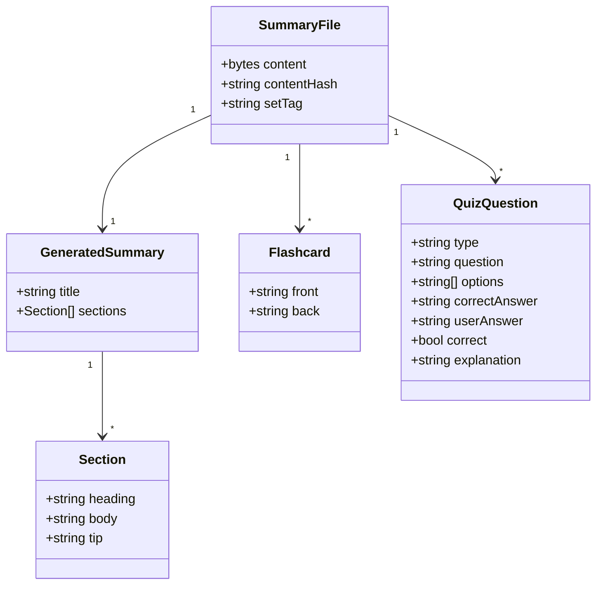
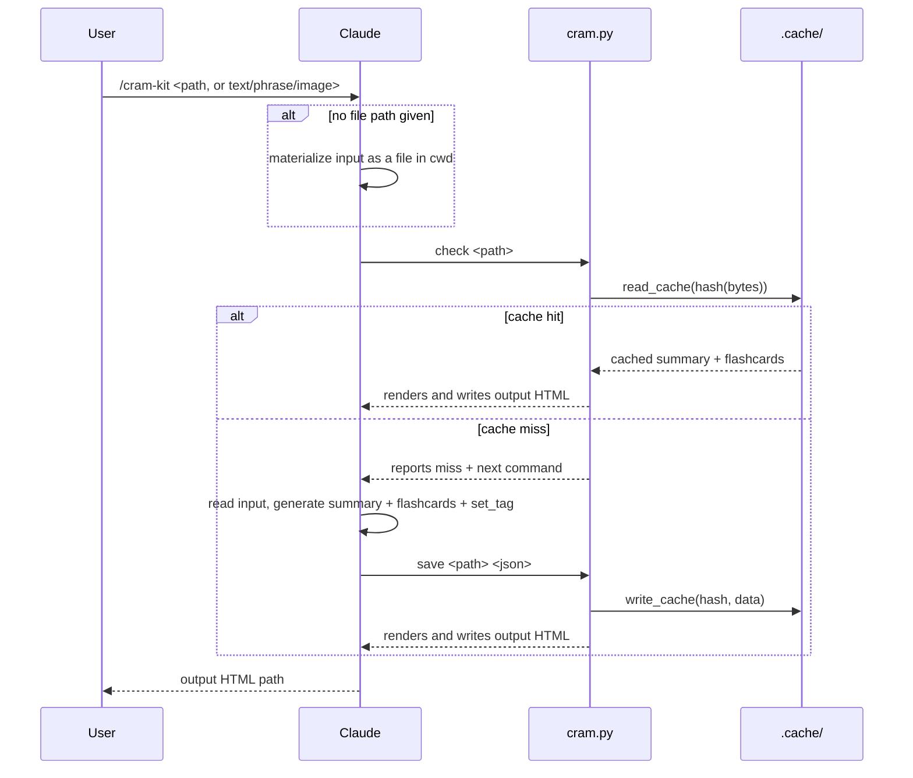

# Architecture

## Domain Model

A `SummaryFile` is the input — identified by the content hash of its raw bytes, not decoded text, so the same hash works whether the input is text or an image. It doesn't need to already exist: Claude materializes pasted text, a phrase, or an image transcription into a real file first if none was given. Each `SummaryFile` gets a Set tag (Claude-suggested from the content, falling back to the filename), which every `Flashcard` and `QuizQuestion` derived from it carries too, so printouts that get physically mixed can be traced back to their source.

`GeneratedSummary` and `Flashcard`s are generated together in one pass and cached as a unit, keyed by the `SummaryFile`'s hash — regenerated only when the hash changes, or when the user explicitly asks for a redo (which overwrites the existing cache entry rather than creating a second one). `QuizQuestion`s are drawn from that cached content, never from the raw input directly, and are never cached themselves — every quiz run regenerates fresh, with no fixed count or natural end.

## Check/Save Flow

This is the flow every invocation goes through — quiz included, since it needs a `GeneratedSummary`/`Flashcard`s to exist before it can draw questions from them.

Quiz extends this rather than replacing it: after a `check`/`save` round trip ensures the cache entry exists, `load <path>` reads it back as JSON (erroring if it's somehow still missing — quiz never generates its own summary/flashcards), and `quiz-save <path> <json>` renders the recap HTML at the end without touching `.cache/` at all.
